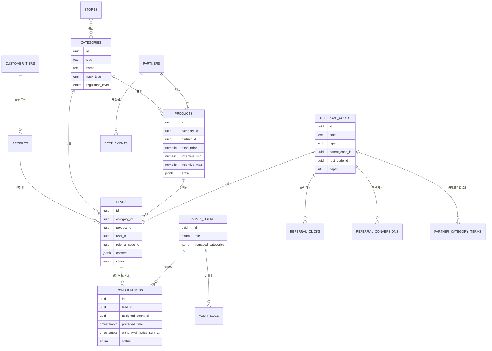

# 플랜파트너스 공식 홈페이지 제작 가이드

이 문서는 아정당(ajd.co.kr) 벤치마킹 분석에서 발견한 구조적 모순(멀티도메인 분절, 정보 게이팅, 규제 불균형 무시)을 반영해, **플랜파트너스**를 하나의 통합 홈페이지로 설계·제작하기 위한 가이드입니다. 관리자페이지 구성안, Supabase 데이터베이스 구조, 유사 프로젝트(Bizmobile) 벤치마킹을 통한 기능 적용 분석을 추가했고, 마지막에는 실제 제작 시 그대로 사용할 수 있는 AI 프롬프트 모음을 포함했습니다.

- 대상 서비스: 플랜파트너스 공식 홈페이지
- 취급 카테고리: 인터넷 · 휴대폰 · 가전렌탈 · 보험 · 상조 (5종)
- 핵심 변경점: **벤치마킹 대상은 카테고리마다 도메인을 쪼갰지만, 플랜파트너스는 하나의 도메인·하나의 코드베이스로 통합 관리한다.**
- 작성일: 2026-08-29

---

## 0. 이 가이드가 해결하려는 문제

지난 분석에서 정리한 아정당 구조의 모순과, 이번 가이드에서의 대응 방식은 다음과 같습니다.

| 아정당에서 발견된 문제 | 플랜파트너스의 대응 |
|---|---|
| 인터넷·휴대폰·신청서가 각각 다른 도메인(ajd.co.kr / ajdphone.co.kr / platform-form.ajd.co.kr)으로 쪼개져 있어 세션·브랜드 경험이 끊김 | **단일 도메인, 단일 코드베이스**로 통합. 로그인 세션은 하나, 배포도 하나 |
| 직접 URL 진입 시 화면이 깨지는 라우팅/렌더링 오류 | 카테고리 랜딩 페이지는 **SSR(서버사이드 렌더링)** 적용, 직접 진입 시나리오를 배포 전 필수 테스트로 고정 |
| 사은품 금액을 완전히 가려 로그인을 강제(다크패턴 소지) | **부분 공개형 게이팅**으로 전환 — 비회원도 예상 범위는 보고, 정확한 금액만 로그인 후 공개 |
| 통신판매중개업이면서 직거래 업체처럼 홍보하는 이중 포지셔닝 | 카피 원칙에서 **"우리는 비교·중개 전문가"임을 명시**하고 이를 신뢰 요소로 전환 |
| 인터넷·휴대폰과 보험·상조를 동일한 가벼운 UX(퀴즈→셀프가입)로 처리 | **규제 강도별 2트랙 UX**(셀프서비스형 / 상담필수형) 도입 |
| 카테고리 추가 때마다 상품 테이블 구조를 새로 설계해야 하는 경직된 스키마 | **공통 필드 + 카테고리별 확장 필드(JSON)** 구조로 처음부터 확장 가능하게 설계 |

---

## 1. 브랜드 & 카피 원칙

- **정직한 중개자 포지셔닝**: "플랜파트너스는 여러 통신사·보험사·상조회사를 비교해 가장 유리한 조건을 찾아드리는 비교 전문 플랫폼입니다"라는 문장을 회사소개·푸터·신청서 시작 화면에 일관되게 노출합니다. 직접 판매자처럼 보이려는 문구("본사 직거래", "자체 특허 최저가" 류)는 지양합니다.
- **정보 비공개보다 단계적 공개**: 어떤 화면에서도 "완전히 가려진 숫자"는 만들지 않습니다. 비회원에게는 범위값(예: "40~55만원대"), 회원에게는 정확한 값을 보여주는 2단계 공개를 기본 규칙으로 합니다.
- **카테고리별 톤 차등**: 인터넷·휴대폰·가전렌탈은 실용적/숫자 중심 톤, 보험·상조는 설명 중심/신뢰 중심 톤을 사용합니다. 같은 폰트·컬러 시스템 안에서 톤(카피 길이, 일러스트 사용 여부)만 다르게 가져갑니다.
- **CTA 문구는 상태를 정확히 말합니다**: "셀프가입"은 실제로 셀프로 끝나는 흐름에만 쓰고, 상담이 필수인 보험·상조에는 "상담 신청" 또는 "무료 상담 예약"처럼 실제 다음 단계를 정확히 표현합니다.

---

## 2. 통합 아키텍처 개요

### 2-1. 구조 비교

```
[아정당 방식 — 지양]                      [플랜파트너스 방식 — 채택]

ajd.co.kr (메인)                          planpartners.co.kr (단일 도메인)
   │                                          │
   ├─ ajdphone.co.kr (휴대폰, 별도 법인/배포)   ├─ /internet
   │                                          ├─ /mobile
   └─ platform-form.ajd.co.kr (공용 폼, 별도)   ├─ /rental
                                               ├─ /insurance
      → 도메인 3개, 세션 3개, 배포 파이프라인 3개  ├─ /funeral
                                               └─ /apply/[category] (내부 모듈)

                                               → 도메인 1개, 세션 1개, 배포 파이프라인 1개
                                                 (내부적으로는 모듈/폴더로 분리해 유지보수성 확보)
```

### 2-2. 원칙

1. **도메인은 하나, 모듈은 여러 개**: 배포 단위(도메인)는 통합하되, 코드 구조는 `features/internet`, `features/mobile`, `features/insurance`처럼 카테고리별 폴더로 분리해 팀별 작업 충돌을 막습니다.
2. **신청서는 별도 사이트가 아니라 내부 라우트**: `platform-form` 같은 외부 서브도메인 대신 `/apply/[category]`라는 내부 라우트로 흡수하되, 카테고리별로 다른 단계(보험·상조는 상담 예약 단계 추가)를 끼워 넣을 수 있게 컴포넌트를 분리합니다.
3. **인증은 앱 전체에서 하나**: 카카오 소셜 로그인 + 비회원 진행을 앱 최상단(전역 상태)에서 관리해, 카테고리를 넘나들어도 로그인 상태가 끊기지 않게 합니다.
4. **렌더링 전략 이원화**: 카테고리 랜딩·상품 상세처럼 검색 유입이 중요한 페이지는 SSR/SSG, 퀴즈·신청서처럼 상호작용이 많은 페이지는 CSR로 처리합니다(Next.js App Router 기준 서버/클라이언트 컴포넌트 혼합).

### 2-3. 권장 기술 스택

| 영역 | 권장 스택 | 이유 |
|---|---|---|
| 프레임워크 | Next.js (React, App Router) | SSR/SSG와 CSR을 한 코드베이스에서 혼합 가능 — 직접 URL 진입 렌더링 문제 해결 |
| 스타일링 | Tailwind CSS + 디자인 토큰(CSS 변수) | 카테고리별 톤 차등을 토큰 레벨에서 관리 |
| 상태관리 | React Query(서버 상태) + 경량 전역 스토어(로그인/세션) | 상품 목록·퀴즈 결과 캐싱과 인증 상태를 분리 관리 |
| DB | PostgreSQL (JSONB 확장 필드 지원) | 카테고리별 확장 스키마 요구에 적합 |
| 인증 | 카카오 OAuth + 자체 세션(비회원 게스트 토큰) | 관찰된 사용자 흐름과 동일하되 단일 도메인 쿠키로 관리 |
| 배포 | 단일 파이프라인(모노레포, feature 폴더 기준 CODEOWNERS) | 배포 단위 통합 + 카테고리별 리뷰 책임 유지 |

---

## 3. 사이트맵 (통합 라우트 구조)

```
/                          홈 (배너 + 5개 카테고리 아이콘 그리드 + 후기/콘텐츠)
/internet                  인터넷 랜딩 (셀프서비스 트랙)
/mobile                    휴대폰 랜딩 (셀프서비스 트랙 + 매장 locator 섹션 내장)
/rental                    가전렌탈 랜딩 (셀프서비스 트랙)
/insurance                 보험 랜딩 (상담필수 트랙)
/funeral                   상조 랜딩 (상담필수 트랙)
/quiz/[category]           카테고리별 추천 퀴즈 (공통 컴포넌트, 문항만 카테고리별 데이터로 분리)
/compare/[category]        비교 결과 리스트 (공통 컴포넌트)
/apply/[category]          신청서 (공통 셸 + 카테고리별 단계 삽입)
/consult/[category]        상담 예약 (보험·상조 전용, 상담필수 트랙에서만 진입)
/stores                    오프라인 매장 찾기 (기존 휴대폰 전용 → 전 카테고리 공용으로 승격)
/mypage                    마이페이지 (신청 내역, 사은품 현황)
/login (모달)               카카오 로그인 / 비회원 계속
```

---

## 4. 카테고리 규제 등급 및 UX 트랙

| 카테고리 | 규제 강도 | 트랙 | 최종 액션 | 필수 고지 사항 |
|---|---|---|---|---|
| 인터넷 | 낮음 | 셀프서비스 | 셀프가입 / 상담연결(선택) | 통신판매중개업 고지 |
| 휴대폰 | 중간 | 셀프서비스 | 셀프가입 / 매장방문 | 통신판매중개업 고지, 단말기 유통법 관련 고지 |
| 가전렌탈 | 낮음~중간 | 셀프서비스 | 셀프가입 / 상담연결(선택) | 약정 해지 위약금 고지 |
| 보험 | 높음 | **상담필수** | 상담 예약 → 설계사 연결 → (셀프가입 불가) | 모집인 등록번호, 완전판매모니터링, 청약철회 안내 |
| 상조 | 높음 | **상담필수** | 상담 예약 → 설계사 연결 → (셀프가입 불가) | 선불식 할부거래업 등록번호, 소비자피해보상보험 가입 여부 |

> 보험·상조는 "셀프가입" 버튼 자체를 노출하지 않고 "무료 상담 예약"만 제공하는 것을 원칙으로 합니다. 이는 완전판매 의무를 UX 단에서부터 지키기 위한 설계입니다.

---

## 5. 디자인 시스템 가이드

### 5-1. 토큰 원칙 (예시 — 실제 값은 브랜드 확정 후 조정)

- **베이스 컬러**: 중립 배경은 순백/순회색 대신 미세하게 브랜드 색조를 섞은 톤으로 선택(예: 아주 옅은 남색빛 오프화이트)
- **프라이머리**: 신뢰감을 주는 딥 네이비 계열 — 보험·상조 랜딩에서 특히 비중 있게 사용
- **액센트**: 인터넷·휴대폰·가전렌탈의 "혜택/가격" 강조용 웜톤 컬러 — 보험·상조에는 절제해서 사용(과도한 프로모션 톤 지양)
- **역할별(트랙별) 보조 컬러**: 셀프서비스 트랙 배지 색 vs 상담필수 트랙 배지 색을 다르게 두어, 사용자가 "이 카테고리는 상담이 필요하구나"를 색만 봐도 인지하게 합니다.

### 5-2. 컴포넌트 규칙

- **게이팅 컴포넌트**: 항상 "범위값(비회원) → 정확한 값(회원)" 2단계로 렌더링. 완전 블러 마스킹(`***,***`) 패턴은 사용 금지.
- **트랙 표시 배지**: 카테고리 랜딩 상단에 "셀프가입 가능" 또는 "전문 상담 필수"를 뱃지로 명시.
- **신청서 진행률 바**: 인터넷/휴대폰/가전렌탈은 %진행률 바, 보험/상조는 "상담 예약 단계"를 별도 스텝으로 시각화(예: 1.정보입력 → 2.상담사 배정 → 3.상담 진행 → 4.가입 확정).
- **중개자 고지 컴포넌트**: 모든 상품 카드 하단에 "본 상품은 [제휴사명]의 상품이며, 플랜파트너스는 비교·중개 서비스를 제공합니다" 문구를 작게라도 상시 노출.

---

## 6. 데이터 모델 가이드 (개념 스키마)

```
Category
 ├─ id, name, slug, track_type (SELF_SERVICE | CONSULT_REQUIRED)
 └─ regulation_level (LOW | MEDIUM | HIGH)

Product
 ├─ id, category_id, partner_id, base_price, incentive_amount
 ├─ common_fields: { title, thumbnail, badge_rank }
 └─ extra_fields (JSONB) — 카테고리별 상이한 스펙
      ├─ internet: { carrier, speed, tv_channel_count }
      ├─ mobile:   { manufacturer, model, storage, carrier }
      ├─ rental:   { product_type, contract_months, monthly_fee }
      ├─ insurance:{ insurer, coverage_summary, monthly_premium }
      └─ funeral:  { provider, plan_name, installment_count }

Lead (신청/리드)
 ├─ id, category_id, product_id, user_id(nullable, 비회원 허용)
 ├─ contact_info (암호화 저장)
 ├─ consent_flags (JSONB) — 카테고리별 필수 동의 항목 체크리스트
 └─ track_type — SELF_SERVICE면 즉시 접수, CONSULT_REQUIRED면 상담 예약으로 라우팅

ConsultationBooking (상담필수 트랙 전용)
 ├─ lead_id, preferred_time, assigned_agent_id
 └─ status (예약됨 | 상담완료 | 청약철회안내완료 | 가입확정)

Store (오프라인 매장, 전 카테고리 공용)
 ├─ id, region, address, supported_categories[]
```

이 구조의 핵심은 `extra_fields`를 JSONB로 두어 **6번째 카테고리가 추가돼도 테이블을 새로 만들지 않는 것**, 그리고 `Lead`와 `ConsultationBooking`을 분리해 **보험·상조의 상담 프로세스를 셀프가입 프로세스와 코드 레벨에서 완전히 갈라두는 것**입니다.

> 이 스키마는 개념 수준의 요약이며, 실제 Supabase 테이블 정의(컬럼 타입, RLS 정책, 추천인/등급/트래킹 확장 테이블 포함)는 §10에서 구체화합니다.

---

## 7. 컴플라이언스 체크리스트

- [ ] 통신판매중개업 등록번호를 전 페이지 푸터에 고지했는가
- [ ] 보험 카테고리: 모집인/설계사 등록번호, 완전판매모니터링 절차, 청약철회 안내 문구가 상담 예약 완료 화면에 포함됐는가
- [ ] 상조 카테고리: 선불식 할부거래업 등록번호, 소비자피해보상보험 가입 여부가 상품 상세와 신청 완료 화면에 모두 노출됐는가
- [ ] 개인정보 수집 동의: 카테고리별로 필요한 항목만 최소 수집하는가(보험만 건강정보 등 민감정보 별도 동의를 받는가)
- [ ] 게이팅 UI가 완전 비공개가 아니라 범위값이라도 비회원에게 제공하는가
- [ ] "셀프가입"이라는 표현이 실제 셀프로 완결되는 카테고리에만 쓰였는가(보험·상조에 오용되지 않았는가)

---

## 8. 운영 거버넌스

- **코드 오너십**: `features/insurance`, `features/funeral` 폴더는 법무 검토가 필요한 변경 시 PR에 `compliance-review` 라벨을 강제하고, 해당 라벨이 없으면 머지가 막히도록 설정합니다.
- **디자인 시스템 단일화**: 컴포넌트 라이브러리를 사내 패키지 하나로 관리해, 카테고리가 늘어나도 버튼·배지·카드 스타일이 갈라지지 않게 합니다.
- **직접 URL 진입 테스트를 CI 필수 항목으로**: 배포 파이프라인에 "각 카테고리 랜딩/신청서 URL에 새로고침 진입 시 정상 렌더링되는가"를 자동 테스트로 등록합니다.
- **모니터링**: 단일 도메인이므로 크로스 도메인 세션 문제는 사라지지만, 카테고리별 전환율·이탈 지점(퀴즈 몇 번째 문항에서 이탈하는지)은 대시보드로 분리 추적합니다.

---

## 9. 관리자페이지 구성

관리자페이지는 고객용 사이트와 달리 **별도 서브도메인(`admin.planpartners.co.kr`) 또는 별도 미들웨어로 분리**하는 것을 원칙으로 합니다. §2의 "단일 도메인 통합" 원칙은 고객이 마주치는 5개 카테고리 화면에 해당하는 것이고, 관리자 도구는 보안 경계가 달라야 하기 때문입니다(IP 제한, 별도 세션, 강한 권한 검증).

### 9-1. 모듈 구성

| 모듈 | 내용 |
|---|---|
| 대시보드 | 카테고리별 신규 리드 수, 전환율, 상담 대기열, 사은품 지급 현황. 셀프서비스 트랙은 "전환율", 상담필수 트랙은 "상담 완료율" 중심으로 위젯 구성을 분리 |
| 상품 관리 | 카테고리별 상품 CRUD. `extra_fields`가 카테고리마다 다르므로 JSON 스키마 기반 동적 폼으로 구현 — 신규 카테고리 추가 시 관리자 화면 코드를 새로 짜지 않아도 되게 함 |
| 리드 관리(셀프서비스 전용) | 인터넷·휴대폰·가전렌탈 신청 건 조회, 상태 변경(접수→처리중→완료), CS 메모 |
| 상담 관리(보험·상조 전용) | 리드 관리와 완전히 분리. 상담사 배정, 예약 캘린더, 상담 결과 기록, **청약철회 안내 발송 시각**을 타임스탬프로 남기는 필드 필수(분쟁 시 법적 절차 준수 증빙) |
| 제휴사 관리 | 통신사·보험사·상조회사·렌탈사·매장 운영사 CRUD, 계약조건·정산기준 |
| 사은품/정산 관리 | 담당자 등록 → 팀장 승인 → 지급의 2단계 승인 프로세스로 중복 지급 방지 |
| 매장 관리 | 오프라인 지점 CRUD, 지역별 노출 설정 |
| 콘텐츠 관리(CMS) | 배너·팝업·위젯·SNS·카테고리 진열을 하나의 화면에 탭으로 묶어 관리(§11 참고) |
| 회원/개인정보 관리 | **누가 언제 어떤 개인정보를 조회했는지 접근 로그를 남기는 것이 핵심** — 보험·상조의 민감정보 처리에 개인정보보호법상 접근기록 보관 의무가 걸림 |
| 권한(역할) 관리 | 아래 9-2 매트릭스 기준으로 메뉴별 view/create/edit/delete 권한 제어 |

### 9-2. 관리자 역할(RBAC) 매트릭스

| 역할 | 접근 범위 | 비고 |
|---|---|---|
| 슈퍼관리자 | 전체 | 정산/권한 설정 가능 |
| 카테고리 운영자 | 본인이 담당하는 카테고리(예: 보험만)의 상품·리드 | 다른 카테고리 데이터는 아예 조회 불가 |
| CS 상담사 | 배정된 리드/상담 건만 | 정산·상품 등록 권한 없음 |
| 정산 담당자 | 정산·사은품 지급 화면만 | 개인정보 열람 최소화 |
| 콘텐츠 담당자 | CMS만 | 리드/상담 데이터 접근 불가 |

> **주의(§11 참고)**: 고객 등급(포인트/혜택)과 관리자 권한(RBAC)은 반드시 별도 테이블로 분리합니다. 하나의 테이블에 섞으면 "일반 회원 등급을 실수로 관리자 권한으로 전환"하는 사고가 날 수 있습니다.

---

## 10. Supabase 데이터베이스 구조

Supabase(PostgreSQL + Auth + Storage + Realtime + Row Level Security)를 기준으로 한 스키마입니다. §6의 개념 스키마를 구체화하고, §11의 벤치마킹 분석에서 채택하기로 한 추천인·등급·트래킹 테이블을 포함합니다.

### 10-1. ERD 개요



### 10-2. 핵심 테이블 정의

```sql
-- Supabase Auth의 auth.users를 확장하는 관례
create table profiles (
  id uuid primary key references auth.users(id),
  display_name text,
  phone text,
  tier_id uuid references customer_tiers(id),
  marketing_opt_in boolean default false,
  created_at timestamptz default now()
);

-- 고객 등급 (관리자 권한과 완전히 분리 — §11 참고)
create table customer_tiers (
  id uuid primary key default gen_random_uuid(),
  name text,                          -- 일반 / 실버 / 골드
  point_earn_rate numeric default 0,
  badge_color text,
  perks jsonb default '{}'            -- 카테고리별 우대 혜택(예: 보험 상담 우선배정)
);

create table categories (
  id uuid primary key default gen_random_uuid(),
  slug text unique not null,          -- 'internet' | 'mobile' | 'rental' | 'insurance' | 'funeral'
  name text not null,
  track_type text not null check (track_type in ('self_service','consult_required')),
  regulation_level text not null check (regulation_level in ('low','medium','high')),
  is_active boolean default true
);

create table partners (
  id uuid primary key default gen_random_uuid(),
  category_id uuid references categories(id),
  name text not null,
  biz_reg_no text,
  settlement_rate numeric,
  contract_status text default 'active'
);

create table products (
  id uuid primary key default gen_random_uuid(),
  category_id uuid references categories(id),
  partner_id uuid references partners(id),
  title text not null,
  base_price numeric,
  incentive_min numeric,   -- 비회원에게 보여줄 범위값 하한
  incentive_max numeric,   -- 비회원에게 보여줄 범위값 상한
  incentive_exact numeric, -- 로그인 후에만 노출
  extra jsonb default '{}',
  is_active boolean default true,
  created_at timestamptz default now()
);

create table leads (
  id uuid primary key default gen_random_uuid(),
  category_id uuid references categories(id),
  product_id uuid references products(id),
  user_id uuid references profiles(id),
  guest_contact jsonb,
  consent jsonb not null,
  status text default 'received',
  referral_code_id uuid references referral_codes(id),
  referrer_url text,
  utm_source text,
  utm_medium text,
  utm_campaign text,
  created_at timestamptz default now()
);

create table consultations (
  id uuid primary key default gen_random_uuid(),
  lead_id uuid references leads(id),
  assigned_agent_id uuid references admin_users(id),
  preferred_time timestamptz,
  status text default 'booked',
  call_log text,
  withdrawal_notice_sent_at timestamptz,
  created_at timestamptz default now()
);

create table admin_users (
  id uuid primary key references auth.users(id),
  role text not null check (role in ('super_admin','category_manager','cs_agent','settlement_manager','content_manager')),
  managed_categories jsonb default '[]'
);

create table audit_logs (
  id bigint generated always as identity primary key,
  actor_id uuid,
  action text,
  target_table text,
  target_id uuid,
  accessed_fields jsonb,
  created_at timestamptz default now()
);

-- 추천인 코드 (다단계 트리 — §11 Bizmobile 분석에서 채택)
create table referral_codes (
  id uuid primary key default gen_random_uuid(),
  code text unique not null,
  name text,
  type text check (type in ('partner','member')),
  parent_code_id uuid references referral_codes(id),
  root_code_id uuid references referral_codes(id),
  depth int default 0,
  total_clicks int default 0,
  total_registrations int default 0,
  is_active boolean default true,
  expires_at timestamptz
);

-- 파트너별 카테고리 조건 오버라이드 (없으면 기본값 폴백)
create table partner_category_terms (
  referral_code_id uuid references referral_codes(id),
  category_id uuid references categories(id),
  benefit_type text check (benefit_type in ('none','fixed_discount','percent_discount','priority_consult')),
  benefit_value numeric,
  primary key (referral_code_id, category_id)
);

create table referral_clicks (
  id bigint generated always as identity primary key,
  code_id uuid references referral_codes(id),
  ip text, user_agent text, session_id text,
  created_at timestamptz default now()
);

create table referral_conversions (
  id bigint generated always as identity primary key,
  code_id uuid references referral_codes(id),
  root_code_id uuid references referral_codes(id),
  lead_id uuid references leads(id),
  conversion_type text,   -- 'registration' | 'lead' | 'consultation'
  depth int,
  created_at timestamptz default now()
);

create table stores (
  id uuid primary key default gen_random_uuid(),
  region text,
  address text,
  lat double precision,
  lng double precision,
  supported_categories jsonb default '[]'
);

-- 운영 편의를 위한 키-값 설정 테이블 (§11 Bizmobile site_settings 패턴 채택)
create table site_settings (
  key text primary key,
  value jsonb not null,
  updated_at timestamptz default now()
);
```

### 10-3. RLS(Row Level Security) 정책 방향

- `leads`, `consultations`: 일반 사용자는 `auth.uid() = user_id`인 행만 조회 가능
- `admin_users.managed_categories`를 참조하는 정책 함수를 만들어, 카테고리 운영자는 자기 담당 카테고리의 `products`/`leads`만 접근 가능하게 제한
- `consultations.call_log`, `leads.guest_contact` 같은 민감 필드는 더 좁은 별도 정책(또는 마스킹 뷰)으로 제한
- `audit_logs`는 `insert`만 허용, `update`/`delete` 전면 금지(트리거로 자동 기록, 감사 기록 위변조 방지)

### 10-4. Supabase 특성상 유의사항

1. **카카오 로그인은 Supabase Auth 기본 제공 목록에 없습니다.** Custom OIDC 프로바이더 등록 또는 자체 서버에서 카카오 OAuth 처리 후 Admin API로 세션을 발급하는 브릿지 방식이 필요합니다.
2. **Storage 버킷**은 `banners`, `product-thumbnails`, `store-photos`처럼 공개 버킷과, 상담 녹취·증빙서류 같은 민감 파일용 비공개 버킷(서명된 URL 접근)을 분리합니다.
3. **Realtime**은 관리자 대시보드의 "신규 상담 예약 즉시 알림"처럼 실시간성이 꼭 필요한 화면에만 선택적으로 켭니다.

---

## 11. 벤치마킹 사례 적용 분석 — Bizmobile

Bizmobile(휴대폰 상담/판매 쇼핑몰, Next.js + Supabase)의 실제 관리자 시스템 문서를 검토해, 플랜파트너스에 그대로 채택할 것 / 구조를 바꿔서 채택할 것 / 채택하지 않을 것을 구분했습니다.

### 11-1. 그대로 채택

| 기능 | 내용 |
|---|---|
| `site_settings` 키-값 패턴 | 배너·히어로 문구·카테고리 진열 순서를 코드 배포 없이 관리자에서 즉시 변경. §10-2에 반영 |
| 디자인 통합관리 탭 | 배너·팝업·위젯·SNS·카테고리 진열을 하나의 화면에서 탭으로 관리 |
| 엑셀 업로드 | 통신사·보험사가 요금표를 엑셀로 제공하는 경우가 많아 실무적으로 유용 |
| 보안 설정 탭(IP/국가 차단, 로그인 잠금, reCAPTCHA) | 그대로 채택 |
| 텔레그램 알림봇 | 신규 리드·상담 접수·상태 변경을 운영 채널로 실시간 전송. DB 접근 없는 순수 텍스트 포맷터 + fire-and-forget 구조라 안전하게 붙일 수 있음 |
| QR 공유 URL 원칙 | 추천 링크는 반드시 메인 페이지(`/?ref=CODE`)로 연결 — `/apply`나 `/consult`로 바로 보내면 추천 쿠키가 설정되기 전에 폼이 렌더링되어 추적이 누락됨(Bizmobile이 실제로 겪은 문제) |

### 11-2. 구조를 바꿔서 채택

**등급(레벨) 시스템** — Bizmobile은 고객 등급(포인트 적립률, 뱃지)과 관리자 권한(`can_admin_access`, `is_superadmin`, 메뉴별 권한 매트릭스)을 `member_levels` 테이블 하나에 섞어뒀습니다. 실제로 "일반 등급 → 어드민 전환 시 경고 배너"라는 방어 로직이 별도로 필요했을 만큼 위험한 설계입니다. 플랜파트너스는 §10-2처럼 `customer_tiers`(고객 등급)와 `admin_users.role`(관리자 RBAC)을 처음부터 분리합니다. 권한 매트릭스 방식(메뉴별 view/create/edit/delete) 자체는 유용하니 `admin_users.role`에 연결해서 사용합니다.

**추천인코드 / 파트너 네트워크** — `referral_codes`의 다단계 트리(`parent_code_id`/`root_code_id`/`depth`)와 `partner_category_discounts`(파트너별 카테고리 오버라이드, 없으면 기본값 폴백) 구조는 우리 5개 카테고리 구조와 정확히 맞아떨어집니다. 대리점 파트너가 인터넷은 할인, 보험은 우선 상담배정처럼 카테고리마다 다른 조건을 걸 수 있어야 하므로, §10-2의 `partner_category_terms`로 이름과 범위를 확장해서 채택합니다(할인뿐 아니라 `priority_consult` 같은 비금전적 혜택도 포함).

> **주의**: 보험·상조는 파트너 추천이 "모집 위탁"처럼 보이면 보험업법·방문판매법상 별도 등록 요건이 걸릴 수 있습니다. 이 두 카테고리는 추천코드로 "할인"까지는 허용하되, "모집 수당"처럼 보이는 구조는 법무 검토 없이 넣지 않습니다.

**링크추적(유입경로) 시스템** — `member_login_sessions`의 UTM/리퍼러/방문 경로 추적 구조는 유용하지만, Bizmobile은 이걸 회원 세션에만 붙였습니다. 플랜파트너스는 `leads` 테이블에 `referrer_url`/`utm_*`/`referral_code_id`를 직접 붙여서(§10-2), 카테고리별로 "어떤 채널이 실제 신청까지 이어지는지"를 관리자 대시보드에서 바로 집계할 수 있게 합니다.

### 11-3. 채택하지 않음

**강제 로그인 게이트** — Bizmobile은 배경 클릭으로 닫히지 않고, "나중에 로그인" 버튼조차 5초간 숨겨뒀다가 나타나는 팝업입니다. 이는 §0에서 정리한 아정당의 "정보를 인질로 잡는" 다크패턴과 같은 계열이라 채택하지 않습니다. 플랜파트너스는 §5-2의 "비회원 범위값 공개 + 선택적 로그인" 원칙을 그대로 유지합니다.

**UI만 있고 실제로 작동하지 않는 기능** — Bizmobile 문서에는 "포인트 자동 적립 미구현", "추가 회원 필드 UI만 있고 가입폼엔 미연동" 등이 스스로 명시돼 있습니다. 관리자 화면에 버튼은 있는데 실제로 작동 안 하면 운영자가 혼란을 겪습니다. 플랜파트너스는 화면과 실제 동작을 항상 함께 완성하거나, 완성 전에는 화면 자체를 노출하지 않는 것을 원칙으로 합니다.

### 11-4. 개발 시 주의할 함정 (Bizmobile 실제 이력)

- Supabase의 `rpc()`는 스칼라 값이 아니라 쿼리 빌더를 반환합니다 — `update({ col: rpc() })` 같은 패턴은 동작하지 않으니 별도 호출로 분리합니다.
- `.in('col', [])`처럼 빈 배열을 조건으로 넘기면 예상과 다르게 동작할 수 있어 조건부 처리가 필요합니다.
- PATCH API에는 반드시 필드 화이트리스트를 둬서, 유입 트래킹 필드(`utm_source` 등)가 사용자 정보 수정 payload에 실수로 섞여 들어가지 않게 합니다.
- 신규 `site_settings` 키를 추가할 때는 반드시 기본값을 DB에 함께 세팅합니다(없으면 `null` 처리 누락으로 렌더링 오류).

---

## 12. 제작용 프롬프트 모음

아래 프롬프트는 Claude Code, Cursor 등 AI 코딩 도구에 바로 입력해 사용할 수 있도록 작성했습니다. 각 프롬프트는 위 가이드(2~11장)를 전제로 하므로, 실제 사용 시 이 문서 전체를 컨텍스트로 함께 제공하는 것을 권장합니다.

### 12-1. 프로젝트 초기 세팅

```
Next.js(App Router) + TypeScript + Tailwind CSS로 "플랜파트너스" 비교 플랫폼의
프로젝트 뼈대를 만들어줘.

요구사항:
- 라우트: /, /internet, /mobile, /rental, /insurance, /funeral,
  /quiz/[category], /compare/[category], /apply/[category],
  /consult/[category], /stores, /mypage
- features/{internet,mobile,rental,insurance,funeral} 폴더 구조로 카테고리별
  데이터·컴포넌트를 분리하되, 공통 UI는 components/shared에 둘 것
- 카테고리 랜딩(/internet 등)은 Server Component로, 퀴즈·신청서는
  Client Component로 구성해 SSR/CSR을 혼합할 것
- 전역 인증 상태(카카오 로그인 여부, 비회원 게스트 토큰)를 관리하는
  Context/Provider를 최상위에 배치할 것
- 도메인은 하나만 사용하고, "신청서"나 "휴대폰"을 별도 서브도메인으로
  분리하지 말 것 (모두 내부 라우트로 처리)
```

### 12-2. 공통 레이아웃(GNB/Footer)

```
플랜파트너스 홈페이지의 공통 레이아웃 컴포넌트를 만들어줘.

- 상단 GNB: 인터넷 · 휴대폰 · 가전렌탈 · 보험 · 상조 5개 메뉴, 로그인/마이페이지 버튼
- 화면 폭이 좁아지면 하단 고정 탭바(홈 · 맞춤 상품찾기 · 마이페이지)로 전환되는
  반응형 네비게이션
- 보험·상조 메뉴 항목에는 "상담 필수" 작은 배지를 붙일 것 (§4 트랙 표를 참고)
- Footer: 통신판매중개업 등록번호, 대표자, 개인정보책임자, 보험 모집인 등록번호,
  상조 선불식할부거래업 등록번호를 모두 명시하는 법적 고지 영역 포함
- Footer 상단에 "플랜파트너스는 여러 통신사·보험사·상조회사를 비교해드리는
  비교·중개 전문 플랫폼입니다" 문구를 고정 노출
```

### 12-3. 홈페이지

```
플랜파트너스 홈페이지(/) 컴포넌트를 만들어줘.

구성 순서:
1. 히어로 배너 (캐러셀, 3~5슬라이드)
2. 5개 카테고리 아이콘 그리드 (인터넷/휴대폰/가전렌탈/보험/상조) —
   보험·상조 아이콘에는 "상담 필수" 뱃지 표시
3. "내 지원금 확인하기" 플로팅 CTA (스크롤 내내 노출, 클릭 시 /quiz 진입)
4. 카테고리 탭 전환형 실사용 후기 섹션
5. SEO용 콘텐츠 카드 섹션(꿀팁/가이드 글)

주의: 사은품·지원금 금액을 완전히 블러 처리하지 말고, 비회원에게는
"3,40만원대"처럼 범위값을 보여주고 로그인 시 정확한 금액으로 바뀌는
컴포넌트로 구현할 것 (§5-2 게이팅 컴포넌트 규칙 참고)
```

### 12-4. 카테고리 랜딩 — 셀프서비스형 (인터넷/휴대폰/가전렌탈)

```
"셀프서비스 트랙" 카테고리 랜딩 페이지 템플릿을 만들어줘. 이 템플릿은
/internet, /mobile, /rental 세 라우트에서 데이터만 다르게 넣어 재사용할 거야.

구성:
1. 카테고리 히어로 배너
2. 제휴사/브랜드 아이콘 그리드 (예: 인터넷은 통신사 로고, 휴대폰은 제조사 로고)
3. "나에게 맞는 상품 찾기" CTA → /quiz/[category]로 이동
4. 인기 상품 미리보기 리스트 (필터 탭 포함) → 더보기 시 /compare/[category]
5. 휴대폰(mobile) 카테고리에 한해 "오프라인 매장 찾기" 섹션을
   /stores 라우트로 연결해 추가로 렌더링

각 섹션은 category prop 하나로 인터넷/휴대폰/가전렌탈 데이터를 갈아끼울
수 있게 제네릭하게 작성해줘.
```

### 12-5. 카테고리 랜딩 — 상담필수형 (보험/상조)

```
"상담필수 트랙" 카테고리 랜딩 페이지 템플릿을 만들어줘. /insurance, /funeral
두 라우트에서 재사용할 거야. §4의 상담필수 트랙 규칙을 반드시 반영해줘.

구성:
1. 카테고리 히어로 배너 (셀프서비스형보다 설명 카피 비중을 높게)
2. "왜 상담이 필요한가"를 설명하는 신뢰 섹션(등록번호, 자격 정보 고지 포함)
3. 상품 개요 리스트 — 가격/사은품 대신 "보장 요약" 또는 "플랜 요약" 중심으로 노출
4. CTA는 "셀프가입"이 아니라 "무료 상담 예약하기" 단일 버튼으로만 제공 →
   /consult/[category]로 이동
5. 상담 진행 단계 안내 컴포넌트: 1.정보입력 → 2.상담사 배정 →
   3.상담 진행 → 4.가입 확정(청약철회 안내 포함)

셀프가입 버튼이나 즉시결제 UI는 절대 넣지 말 것.
```

### 12-6. 추천 퀴즈 컴포넌트

```
카테고리 공용 추천 퀴즈 컴포넌트(/quiz/[category])를 만들어줘.

- 진행률 바(%)와 함께 멀티스텝으로 진행되는 3문항 구조
- 문항 내용은 category별 JSON 설정으로 주입 (하드코딩 금지)
  예) internet: [희망 통신사, 희망 속도, 결합 옵션]
      insurance: [보장받고 싶은 범위, 연령대, 기존 보험 가입 여부]
- 마지막 문항은 선택사항(건너뛰기 가능)으로 처리
- 제출 시 로딩 애니메이션 후 /compare/[category]로 이동하며 퀴즈 응답값을
  쿼리 파라미터가 아닌 서버 세션/상태로 전달할 것 (URL에 개인정보 노출 금지)
```

### 12-7. 비교 리스트 컴포넌트

```
비교 결과 리스트(/compare/[category])를 만들어줘.

- 정렬/필터 탭 (예: 절약형 / 혜택많은형 / 인기 TOP3) — 탭 라벨은 category별 설정으로 분리
- 결합할인·카드할인 체크박스
- 상품 카드: 순위 뱃지, 가격, 사은품(§5-2 게이팅 규칙 적용 — 범위값→정확값),
  "비교하기" 체크박스로 최대 3개 동시 비교
- 카드 하단에 "본 상품은 [제휴사명]의 상품이며 플랜파트너스는 비교·중개
  서비스를 제공합니다" 고지 문구 상시 노출
- category의 track_type이 SELF_SERVICE면 "셀프가입" 버튼을,
  CONSULT_REQUIRED면 "상담 예약" 버튼만 노출 (버튼 자체가 트랙에 따라
  분기되도록 구현)
```

### 12-8. 신청서 / 상담 예약 폼

```
/apply/[category] (셀프서비스용)과 /consult/[category] (상담필수용) 두
폼 플로우를 만들어줘. 기존 벤치마킹 사례처럼 별도 서브도메인으로 분리하지
말고 동일 프로젝트 내 라우트로 구현할 것.

/apply/[category] 공통 구조:
1. 선택 상품 요약 카드
2. 신청자 정보 입력 (이름/연락처/주소 — 카테고리별 consent_flags에 정의된
   항목만 동적으로 노출)
3. 개인정보 수집 동의 (카테고리별 상이한 항목, 특히 민감정보는 별도 체크박스)
4. 제출 → 완료 화면(예상 처리 기간 안내)

/consult/[category] 전용 추가 구조:
1. 상담 희망 시간대 선택
2. 상담사 배정 안내
3. 완료 화면에 "청약철회 안내" 및 "모집인/설계사 등록번호 확인 방법" 고정 노출
```

### 12-9. 로그인 모달

```
전역에서 재사용하는 로그인 모달 컴포넌트를 만들어줘.

- "카카오로 시작하기" 버튼을 최상단에 배치
- "비회원으로 계속하기" 링크를 보조 옵션으로 배치 (완전히 숨기지 말 것)
- 로그인 성공 시 게이팅된 정보(사은품 정확 금액 등)가 즉시 갱신되도록
  전역 인증 상태와 연결
- 모달은 어떤 카테고리 페이지에서 열리든 동일한 컴포넌트를 재사용 (도메인
  이동 없이 같은 페이지 위에서 열리고 닫혀야 함)
```

### 12-10. 마이페이지

```
/mypage 컴포넌트를 만들어줘.

- 신청 내역 리스트 (카테고리, 상품명, 진행 상태 — SELF_SERVICE는
  "접수/처리중/완료", CONSULT_REQUIRED는 "상담예약/상담완료/가입확정" 상태값 사용)
- 사은품/지원금 지급 현황
- 오프라인 매장 방문 예약 내역(있는 경우)
- 회원 정보 수정, 카카오 연동 해제
```

### 12-11. 관리자 대시보드 (§9, §10 기반)

```
관리자페이지(admin.planpartners.co.kr 또는 /admin, 고객 사이트와 별도 인증)의
대시보드와 상품/리드/상담 관리 화면을 만들어줘.

요구사항:
- §9-2의 RBAC 매트릭스(슈퍼관리자/카테고리운영자/CS상담사/정산담당자/콘텐츠담당자)에
  따라 로그인한 관리자의 role과 managed_categories로 메뉴·데이터 접근을 제한할 것
- 상품 등록/수정 폼은 category를 선택하면 §10-2 products.extra 스키마에 맞춰
  카테고리별로 다른 입력 필드가 동적으로 렌더링되게 할 것 (JSON 스키마 기반 폼)
- 리드 관리 화면과 상담 관리 화면은 완전히 분리된 라우트/컴포넌트로 구현할 것
  (셀프서비스 트랙과 상담필수 트랙의 상태값 체계가 다름)
- 상담 관리 화면에는 withdrawal_notice_sent_at을 기록하는 버튼을 반드시 포함할 것
- 회원 상세 화면에는 개인정보 조회 시 audit_logs에 자동 기록되는 로직을 연결할 것
```

### 12-12. 추천인 파트너 관리 (§10, §11 기반)

```
추천인/파트너 네트워크 관리 화면(관리자 전용)을 만들어줘. §10-2의 referral_codes,
referral_clicks, referral_conversions, partner_category_terms 테이블을 사용할 것.

요구사항:
- 파트너 목록: CVR(전환율), 가입수, 클릭수, 최근등록순 정렬
- 파트너 상세: 하위 추천 체인(parent_code_id/root_code_id/depth 기반 트리) 표시,
  최근 30~90일 전환 추이를 인라인 스파크라인으로 표시
- 카테고리별 조건 설정 탭: partner_category_terms에 값이 있으면 그 값을,
  없으면 "기본값 사용(폴백)"임을 명시적으로 표시
- 추천 링크 공유용 QR 코드 생성 기능. 링크는 반드시 메인 페이지(`/?ref=코드`)를
  가리키게 하고, /apply나 /consult로 직접 연결하지 말 것
  (쿠키 설정 전에 폼이 렌더링되어 추적이 누락되는 것을 방지)
- 보험·상조 카테고리에는 "할인"형 조건(fixed_discount/percent_discount)만 허용하고
  금전적 수당으로 보일 수 있는 조건은 UI에서 아예 선택 불가능하게 제한할 것
```

---

## 13. 최종 점검 체크리스트

- [ ] 모든 카테고리가 하나의 도메인/코드베이스 안에서 서비스되는가 (외부 서브도메인으로 새어나간 기능이 없는가)
- [ ] 보험·상조에 "셀프가입" 버튼이 존재하지 않는가
- [ ] 모든 금액/사은품 게이팅이 완전 블러가 아닌 범위값 공개 방식인가
- [ ] 카테고리 랜딩·상품 상세 페이지가 새로고침/직접 URL 진입 시에도 정상 렌더링되는가
- [ ] 푸터에 카테고리별 법적 고지(통신판매중개업/보험모집인/선불식할부거래업)가 모두 노출되는가
- [ ] 신규 카테고리 추가 시 `extra_fields`만 확장하면 되는 구조인지 실제로 확인했는가
- [ ] 관리자페이지가 고객 사이트와 별도 도메인/인증으로 분리되어 있는가
- [ ] 고객 등급(`customer_tiers`)과 관리자 권한(`admin_users.role`)이 서로 다른 테이블로 분리되어 있는가
- [ ] 강제 로그인 게이트(배경 클릭 무시, 닫기 버튼 지연 노출) 같은 다크패턴이 어디에도 없는가
- [ ] 추천 링크(QR 포함)가 항상 메인 페이지를 가리키고, 신청/상담 페이지로 직접 연결되지 않는가
- [ ] 보험·상조의 추천인 조건에 "모집 수당"으로 오인될 수 있는 항목이 없는가
- [ ] 관리자의 개인정보 조회가 `audit_logs`에 자동 기록되는가
